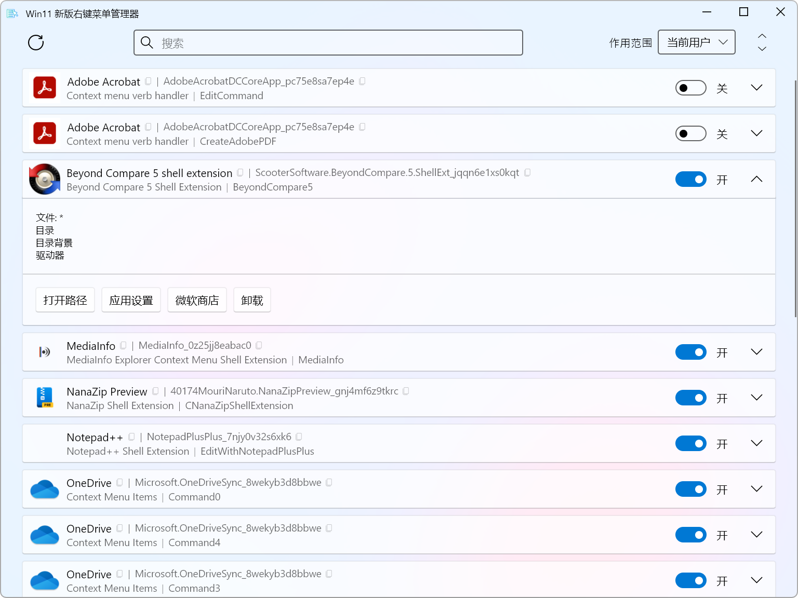

> [!IMPORTANT]
> This is the community Chinese localized version of Windows 11 Context Menu Manager, please visit [branhill/windows-11-context-menu-manager](https://github.com/branhill/windows-11-context-menu-manager). 英文原版请访问 [branhill/windows-11-context-menu-manager](https://github.com/branhill/windows-11-context-menu-manager)。

# Win11 新版右键菜单管理器（汉化版）

用这个小工具来禁用 Win11 新右键菜单中不想要的软件。

## 下载

[汉化版最新版本](https://github.com/zetaloop/windows-11-context-menu-manager/releases/latest)

## 截图

## 许可证

本项目采用 [MIT 许可证](LICENSE)

原作者版权所有 (c) 2024 [Brandon Hill](https://branhill.com/)

喜欢的话，请给原作者一个星标吧 -> [英文原版](https://github.com/branhill/windows-11-context-menu-manager)
